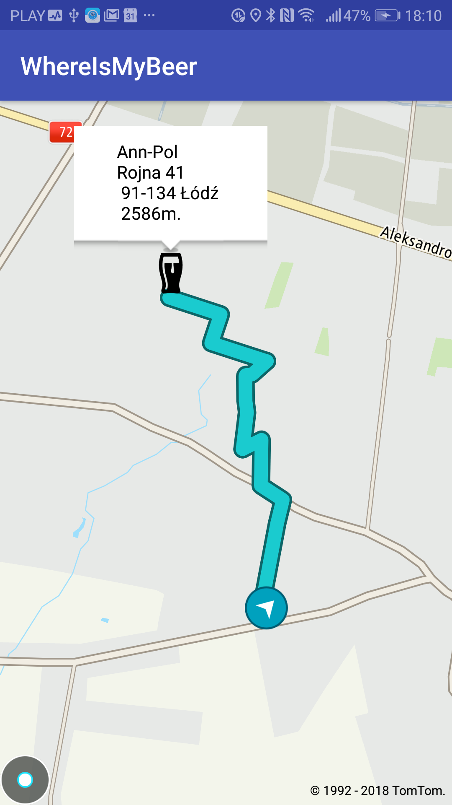
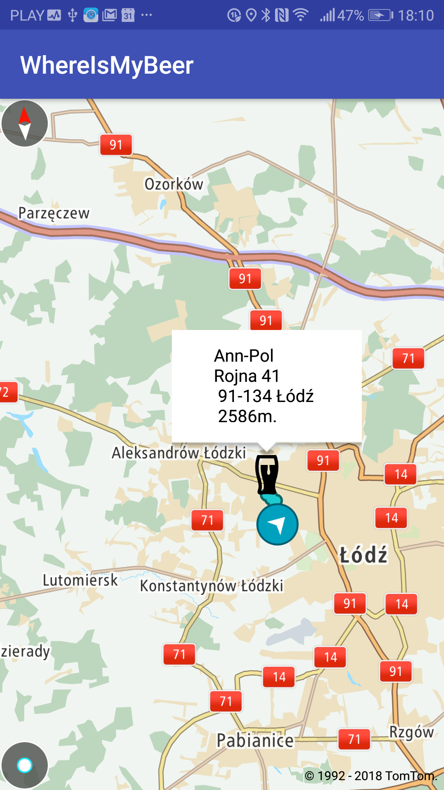

= WhereIsMyBeer

WhereIsMyBeer is the app which will find the nearest bar for you and show you the way to it. 

App show example of usage TomTom Android SDK - https://developer.tomtom.com/maps-sdk-android 

image::https://play.google.com/intl/en_us/badges/images/badge_new.png[]
https://play.google.com/store/apps/details?id=pl.saramak.beer.whereismybeer[Download app from google play]

